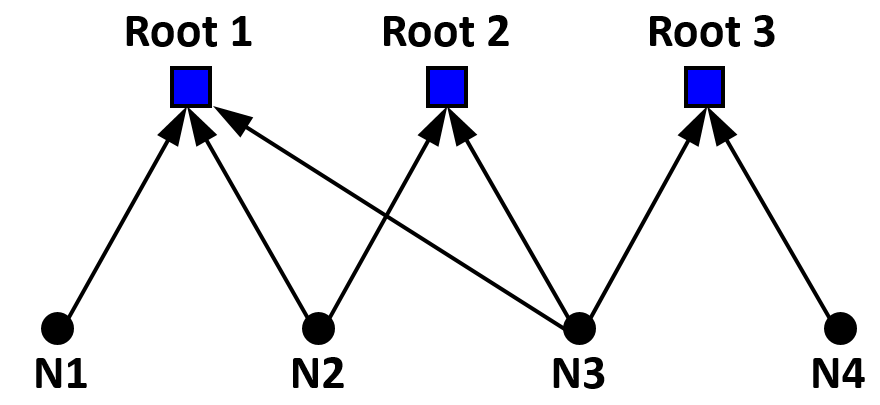
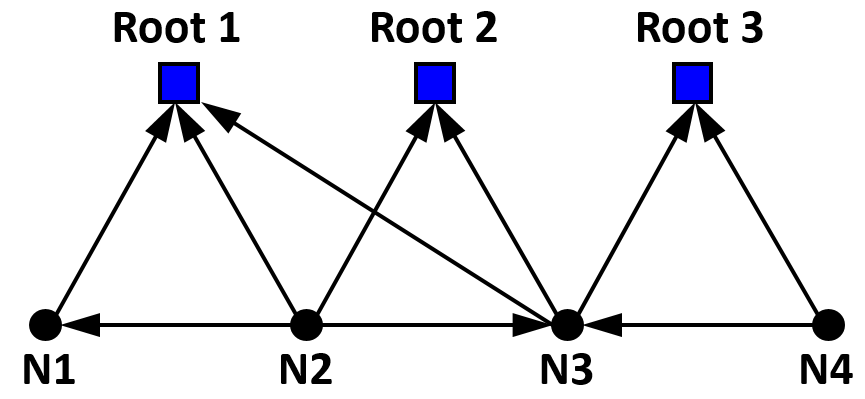
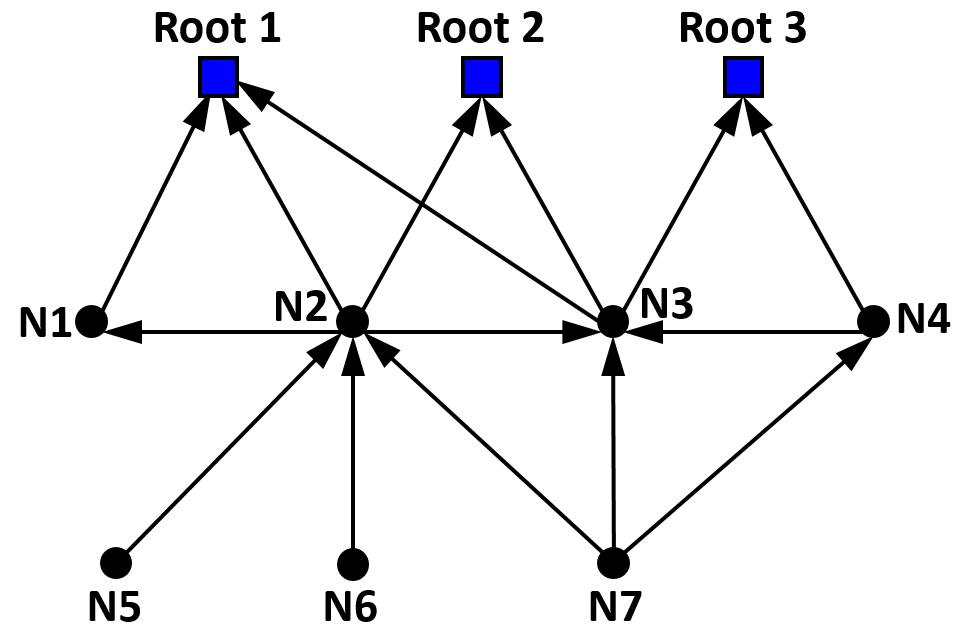

#  
<b> Summary </b> 
The crosswalk depth allows users to determine how far to drill down into the task network when conducting payoff and complexity analysis. 

<ul>
<li> a <b>"1-step"</b> crosswalk depth returns all tasks that directly support a root or set of root nodes. </li>
</ul>

<ul>
<li> selecting a <b>"1.5-step"</b> crosswalk depth returns all tasks that directly support a root or set of root nodes AND includes any links between the supporting tasks. </li>
</ul>

<ul>
<li> selecting a <b>"2-step"</b> crosswalk depth returns all tasks that directly and indirectly support a root or set of root nodes. </li>
</ul>

