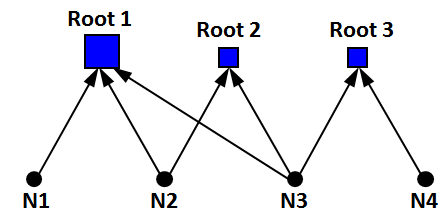

#  

<b> Summary </b> 

Payoff and complexity metrics are descriptive statistics that are intended to be used to inform a Commander's diaglogue when determining tasks to include a Unit Training Plan.

<b> Defintion </b> 

<ul>
<li>The <b>payoff</b> metric measures the number of tasks that are supported by a given task (the number of links directed away from a node). Tasks with high payoff values are tasks that facilitate a unit's ability to peform many other tasks.</li> 

<li>The <b>complexity</b> metric measures the number of supporting tasks (the number of links directed at a given node). Tasks with high complexity are those that implicitly require a unit to be proficient at many other tasks.</li>
</ul>

<b> Example </b>

In the graph shown below, node 3 would be considered the highest payoff task because it support 3 of the root nodes. 

In contrast, Root 1 would be considered most complex task because it implicitly requires proficiency at tasks N1, N2, and N3. 

