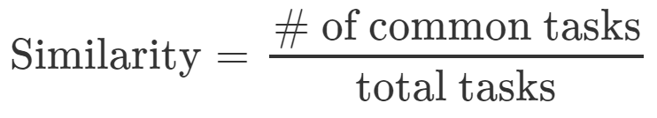
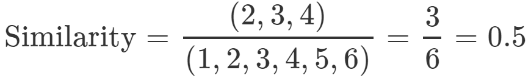
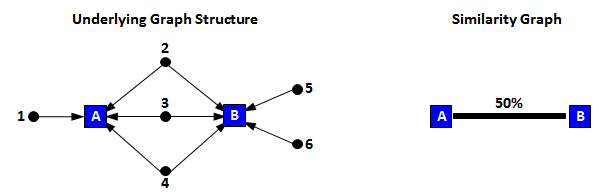

#  

<b> Summary </b> 

The similarity metric infers relationships between collective tasks based on common individual tasks. This type of approach is commonly used by academic search engines to recommend articles based on the similarity of bibliographic entries. 

If the objective of your training strategy is to train a diverse set of tasks, it might be wise to select dissimilar tasks (tasks that have low to no similarity). In contrast, if you are seeking to to optimize the use of training resources and time, it might be wise to select similar tasks.

<b> Defintion </b>

The <b>similarity</b> between two tasks is defined as the number of common individual tasks divided by the total number of tasks. 

<b> Example </b> 

Consider two collective tasks (A, B) and their supporting individual tasks (1, 2, 3, 4, 5, 6).

If task A has 4 supporting individual tasks (1, 2, 3, 4) and task B has 5 supporting individual tasks (2, 3, 4, 5, 6), then tasks A and B share 3 common tasks (2, 3, 4). 

The similarity score between task A and B would be 50%. 

Graphically, these two tasks would be represented as follows:

